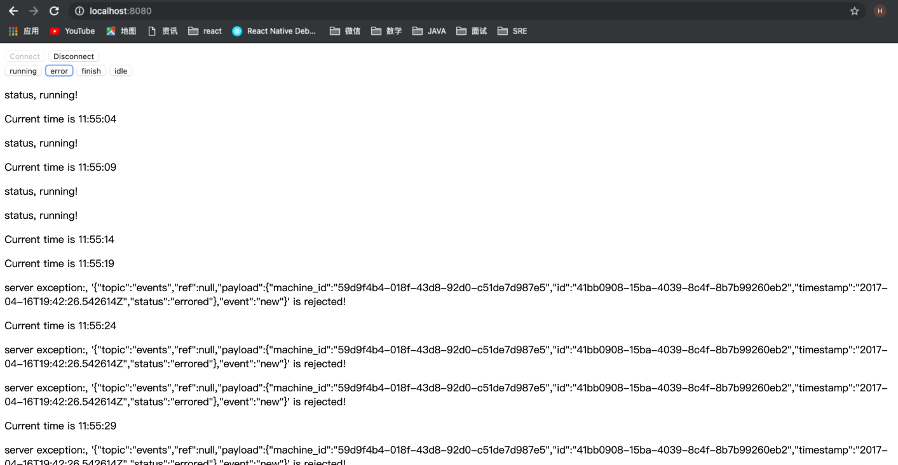

Request:
Currently, there is only a websocket connection which allows receiving a soft-realtime event stream of machine status updates. 
The endpoint’s full url is: ws://machinestream.herokuapp.com/ws, the response looks like this:

{
"topic": "events",
"ref": null,
"payload": {
"machine_id": "59d9f4b4-018f-43d8-92d0-c51de7d987e5",
"id": "41bb0908-15ba-4039-8c4f-8b7b99260eb2",
"timestamp": "2017-04-16T19:42:26.542614Z",
"status": "running"
},
"event": "new"
}

This article is to make a brief introduction, THis solution is implemented WebSockets with the Spring Boot Framework. it cover both the server-side and the client-side setup, 
and we use STOMP over WebSocket protocol to communicate with each other 

The server-side is coded purely in Java. and on the client side is useing the JavaScript (SockJS) Simulation of the Zeiss interface

After the connect button clicked 'ws://localhost:8080/getData' is connected
there are 4 case to Simulation 4 state of Zeiss interface [running, idle, errored, finished] 

When the running button clicked normal data is sended to backend
when the error button clicked is will catch an exception and throw back to frontend
Unfortunately , I didn't find the way to handle finish & idle , these to button's logic now are same as connect & disconecet and didn't send backend

